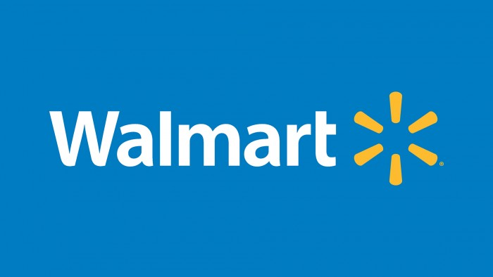

# 🛒🔆🛍️𝕎𝕒𝕝𝕞𝕒𝕣𝕥 ℕ𝕖𝕨 𝕋𝕖𝕔𝕙 𝕀𝕥𝕖𝕞𝕤 𝕎𝕖𝕓 𝕊𝕔𝕣𝕒𝕡𝕚𝕟𝕘 𝕒𝕟𝕕 𝔻𝕒𝕥𝕒 ℂ𝕝𝕖𝕒𝕟𝕚𝕟𝕘 📱🖥️🎮

## Overview 🔍

This repository contains Python scripts and data files used for scraping new tech items from Walmart's website and cleaning the scraped data for further analysis or processing.

## Contents 🗂️

- `web_scrape.py`: Python script for web scraping Walmart's website to extract new tech items.
- `clean_data.py`: Python script for cleaning and preprocessing the scraped data.
- `merge_files.py`: Python script to merge multiple CSV files containing scraped data.
- `merged_data.csv`: Final cleaned and merged data in CSV format.
- `index1.html` to `index9.html`: HTML files containing raw data scraped from Walmart (sample files).
- `data1.csv` to `data9.csv`: CSV files containing cleaned data extracted from corresponding HTML files.

## Tools Used 🛠️

  
  
  
  

- **Pandas:** Data manipulation and analysis.
- **BeautifulSoup:** for HTML parsing and web scraping.
  
## 👩‍💻 Author

- GitHub: [@rania3103](https://github.com/rania3103)
- LinkedIn: [LinkedIn](https://linkedin.com/in/rania-abassi-24105a249)
